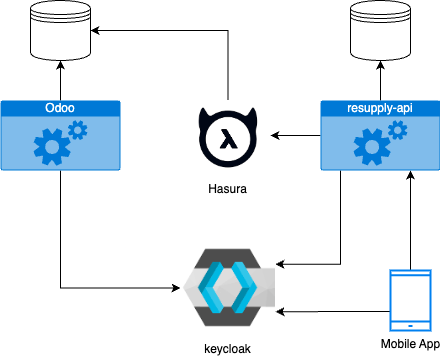
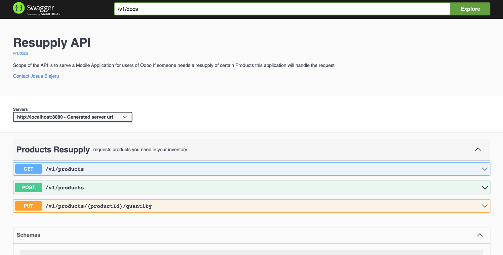

# Odoo Inventory Resupply API

this api is a small demo app to see how a stock resupply
Mobile app might work for a small Mom & Pop's shop using Odoo.

## Architecture

> This is WIP for now and the target architecture and always subject to change!
> 
The Resupply API interacts with Odoo via Hasura.
Because of this, no major modification or modules have to be made for Odoo.
I recommend using Keycloak as a OIDC provider to make things simple,
but it can also be used only for the Inventory Resupply App.


## Tools used

- Spring Boot / Spring Security
- Postgres
- Swagger UI / OpenAPI 3.0
- docker compose
- testcontainers
- liquidbase / hibernate



## Docker Compose
```yaml
services:
  postgres:
    image: 'postgres:latest'
    environment:
      - 'POSTGRES_DB=mydatabase'
      - 'POSTGRES_PASSWORD=secret'
      - 'POSTGRES_USER=myuser'
    ports:
      - '5432:5432'

  backend:
    image: ghcr.io/josuablejeru/resupply-api:latest
    ports:
      - '8080:8080'
```

## Development

Endpoints:

- [Swagger UI](http://localhost:8080/swagger-ui/index.html)
- [OpenAPI 3.0](http://localhost:8080/v1/docs)
